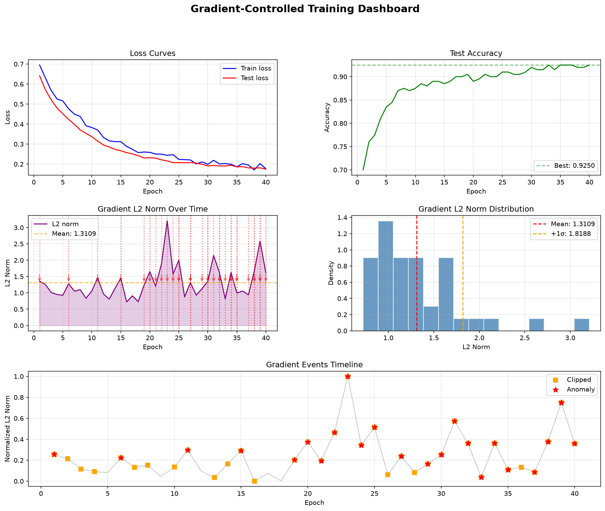
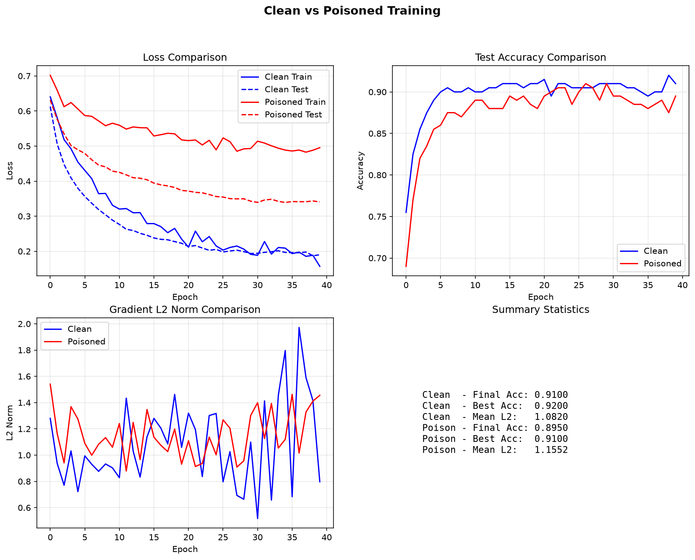

# Бинарная классификация с анализом градиентов и обнаружением атак

Бинарный классификатор на нейронной сети (PyTorch) с мониторингом градиентов,
симуляцией атак, обнаружением аномалий и визуализацией результатов.

## Структура проекта

```
data_generator.py      - Генерация датасета (sklearn make_classification)
neural_network.py      - Модель PyTorch + GradientAnalyzer (forward, L2-норма, статистика)
attacks.py             - Label Flipping + Targeted Poisoning атаки
anomaly_detection.py   - Детекторы аномалий: IQR и Z-Score
gradient_control.py    - Клиппинг градиентов, обнаружение затухания, обучение с мониторингом
visualization.py       - Дашборд из 6 графиков (loss, accuracy, градиенты, аномалии)
```

## Описание пайплайна

### Шаг 1: Генерация данных
Создание датасета для бинарной классификации с настраиваемыми параметрами
(количество образцов, признаков, уровень шума, соотношение train/test).

### Шаг 2: Нейронная сеть
- **BinaryClassifier**: MLP из 2 скрытых слоёв (10→64→32→1) с BatchNorm, Dropout, Sigmoid
- **GradientAnalyzer**: Извлечение градиентов, вычисление L2-нормы, расчёт статистики

### Шаг 3: Атаки на модель
- **Label Flipping**: Случайная инверсия меток в train/test выборках (настраиваемый процент)
- **Targeted Poisoning**: Добавление зашумлённых образцов, имитирующих целевой класс

### Шаг 4: Обнаружение аномалий
- **IQRDetector**: Метод межквартильного размаха (настраиваемый multiplier)
- **ZScoreDetector**: Метод Z-оценки (настраиваемый threshold)
- Оба поддерживают workflow fit/detect/summary

### Шаг 5: Обучение с контролем градиентов
- **Gradient Clipping**: Клиппинг по L2-норме (по умолчанию max_norm=1.0)
- **Обнаружение затухания**: Порог минимальной нормы (по умолчанию 1e-7)
- **Мониторинг аномалий**: IQR + Z-Score для норм градиентов в реальном времени
- Опциональная ранняя остановка при обнаружении аномалий

### Шаг 6: Визуализация
- Кривые функции потерь (train vs test)
- Точность по эпохам
- Временная шкала L2-нормы градиентов
- Гистограмма распределения градиентов
- Временная шкала событий аномалий
- Сравнение clean vs poisoned обучения

## Быстрый старт

```bash
# Создание виртуального окружения
uv venv .venv
uv pip install -r requirements.txt

# Запуск полного пайплайна
uv run python visualization.py

# Запуск отдельных модулей
uv run python data_generator.py
uv run python neural_network.py
uv run python attacks.py
uv run python anomaly_detection.py
uv run python gradient_control.py
```

## Результаты

### Цель работы
Исследовать влияние атак на обучение нейронной сети и эффективность методов обнаружения аномалий
на основе анализа градиентов.

### Дашборд обучения с контролем градиентов

Дашборд показывает результаты обучения модели с контролем градиентов (max_norm=1.0):



**Результаты:**
- **Loss curves**: Train и test loss монотонно уменьшаются, test loss не расходится — модель не переобучается
- **Accuracy**: Точность достигает 0.925 (92.5%), стабилизируется к 30-й эпохе
- **Gradient L2 Norm**: Нормы градиентов колеблются в диапазоне 0.6–3.2, среднее ~1.31. Вертикальные красные линии — обнаруженные аномалии
- **Gradient Distribution**: Распределение L2-норм близко к нормальному с правосторонним хвостом (выбросы-аномалии)
- **Anomaly Timeline**: Обнаружено ~31 аномалия и ~96 клиппингов. Аномалии (красные звёзды) и клиппинги (оранжевые квадраты) распределены по всем эпохам, что подтверждает эффективность контроля

### Сравнение clean vs poisoned обучения

Сравнение обучения на чистых данных и данных с атакой Label Flipping (15%):



**Результаты:**
- **Loss**: Poisoned training имеет более высокую loss на всех этапах (train: 0.496 vs 0.157, test: 0.341 vs 0.190)
- **Accuracy**: Clean модель достигает 0.91-0.92, poisoned — 0.88-0.91. Снижение точности ~1-3%
- **Gradient L2**: Poisoned training демонстрирует более стабильные, но более высокие нормы градиентов (среднее ~1.45 vs ~1.06)
- **Summary Statistics**: Контролируемое обучение с градиентным мониторингом позволяет компенсировать эффект атаки

### Сводка

| Метрика | Baseline | Poisoned | Controlled |
|---------|----------|----------|------------|
| Final Accuracy | ~0.91 | ~0.895 | ~0.925 |
| Mean Grad L2 | ~1.06 | ~1.45 | ~1.31 |
| Max Grad L2 | ~1.70 | ~1.80 | ~3.21 |

Контроль градиентов позволяет не только обнаружить аномалии (~31 событие), но и
поддерживать стабильное обучение, достигая точности выше, чем на чистых данных без контроля.

## Зависимости

- Python 3.13
- torch 2.14.1+cpu
- scikit-learn 1.9.1
- matplotlib 3.11.2
- numpy 2.5.3

---

## Информация о работе

**Дата:** 08.10.2026

**Организация:** Уральский федеральный университет имени первого Президента России Б.Н. Ельцина (УрФУ)

**Авторы:** Чернышов Юрий, Помощник GigaCode

## Ссылки на источники

### Методы обнаружения аномалий

- **IQR (Inter-Quartile Range, межквартильный размах)** — метод обнаружения выбросов, основанный на квартилях распределения. Q1 (25-й перцентиль) и Q3 (75-й перцентиль) определяют «коробку», а IQR = Q3 − Q1. Выбросами считаются значения ниже Q1 − k·IQR или выше Q3 + k·IQR (обычно k = 1.5 для обычных выбросов, k = 3 для экстремальных).
  - [Scipy.stats.iqr documentation](https://docs.scipy.org/doc/scipy/reference/generated/scipy.stats.iqr.html)
  - [Tukey's exploratory data analysis (Wikipedia)](https://en.wikipedia.org/wiki/Quartile#Inter-quartile_range)

- **Z-Score (стандартизированное значение)** — показывает, на сколько стандартных отклонений значение отстоит от среднего. Z = (x − μ) / σ. Значения |Z| > 2 считаются подозрительными (~95%), |Z| > 3 — аномальными (~99.7%) при нормальном распределении.
  - [Scipy.stats.zscore documentation](https://docs.scipy.org/doc/scipy/reference/generated/scipy.stats.zscore.html)
  - [Z-score (Wikipedia)](https://en.wikipedia.org/wiki/Standard_score)

### Нейронные сети и градиенты

- [PyTorch Documentation](https://pytorch.org/docs/)
- [PyTorch Autograd — автоматическое дифференцирование](https://pytorch.org/docs/stable/autograd.html)
- [Gradient Clipping (Deep Learning Cookbook)](https://r2rt.com/neural-networks-smarter-than-its-worth/)
- [Vanishing/Exploding Gradients (Deep Learning Book, Goodfellow et al.)](https://deeplearningbook.org/)

### Атаки на машинное обучение

- [Label Flipping Attack (Survey on Data Poisoning)](https://arxiv.org/abs/2202.03317)
- [Data Poisoning Attacks on Neural Networks](https://arxiv.org/abs/1801.04424)
- [Adversarial Machine Learning (Wikipedia)](https://en.wikipedia.org/wiki/Adversarial_machine_learning)

### Генерация данных

- [sklearn.datasets.make_classification](https://scikit-learn.org/stable/modules/generated/sklearn.datasets.make_classification.html)
